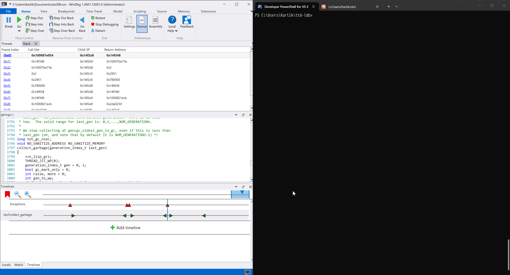

# ttd-ldb
Run SBCL's low-level debugger (LDB) against a dead process.



## Background
[SBCL](https://sbcl.org) is a native-code Common Lisp compiler. I used to use it at work, deploying code primarily to Windows. While we found SBCL to be stable, we encountered one fatal, non-deterministic bug that showed up only on Windows. We used [WinDbg](https://learn.microsoft.com/en-us/windows-hardware/drivers/debuggercmds/windbg-overview), specifically its [Time Travel Debugging](https://learn.microsoft.com/en-us/windows-hardware/drivers/debuggercmds/time-travel-debugging-overview) feature, to root-cause and fix the bug.

The bug turned out to be a Windows-only error in the conservative stack scanning logic in the garbage collector. Finding this bug involved stepping through compiled Lisp machine code, checking page tables, and tracking memory across garbage collections. The SBCL runtime and garbage collector are written in C, so we had some limited support in WinDbg. But any time we were inside compiled Lisp code, the support dropped to zero. For instance, we did not have Lisp backtraces because SBCL uses a different stack format than C. You can see this in the WinDbg window in the demo GIF—the stack is a mess of hex values.

I developed `ttd-ldb` to solve this problem.

## How it works
`ttd-ldb` connects as a client to WinDbg's debug server, communicating with it using the `DbgEng` API. It starts as an empty process. The final thing it does is to query the remote debugger for the address of `ldb_monitor`, the entry point to SBCL's low-level debugger, and call into it. This immediately triggers an access violation because the code is not present in the process.

The setup process ensures that this access violation recovers into smooth execution of LDB instead of a crash. The first step is to set an access violation handler that copies the memory page containing the faulting address from the remote process into the local one and then restarts execution from the faulting instruction.

The second step is to create a local thread with the same stack and stack pointer as the remote thread. The local thread runs a function that will eventually call into LDB. It begins by loading all the DLLs that are loaded in the remote process into the local one by name. ASLR removes any guarantee that the local DLLs will load into the same addresses as in the remote process. This is a problem because all the code paged in from the remote process calls into external DLLs through the remote import address table (IAT), which contains call addresses that don't work in the local address space because of ASLR.

Each IAT entry consists of a function identifier, usually a name, and a function address. Patching the local IAT by looking up each identifier in the appropriate local DLL and writing back the local function address fixes the ASLR issue.

Next, the thread copies its stack extents from the remote thread so that stack bounds checks line up with the remote stack that the parent thread set. The thread also copies a TLS value from the remote thread so that `get_sb_vm_thread()` returns the correct thread.

Finally, the thread prepares to call into LDB. It stores the remote thread's context in the local thread's interrupt context array. LDB consults the interrupt context array to determine where the Lisp code stopped, so this ensures that LDB thinks it is wherever the remote thread was executing at the current point in the TTD trace.

Once this is set, the thread calls `ldb_monitor`, and the debugger starts as if it were running in the original process.

## How to build
### `ttd-ldb`
Run `build.bat` in a Command Prompt or PowerShell that has Clang available. If you installed Clang through the Visual Studio Installer, you can use the Developer Command Prompt/PowerShell.

### SBCL
SBCL does not work out of the box with `ttd-ldb`. TTD only logs memory addresses that are accessed by userspace instructions[^1], but SBCL loads core files into process memory using `NtReadFile`, which does kernel-mode I/O. Touching every byte in the mapped core file chunks with an explicit read instruction as they are loaded solves this. To achieve this, apply this patch to SBCL and build it as usual:

```diff
diff --git a/src/runtime/win32-os.c b/src/runtime/win32-os.c
index 2a09fd118..c8a52b357 100644
--- a/src/runtime/win32-os.c
+++ b/src/runtime/win32-os.c
@@ -723,6 +723,7 @@ void* load_core_bytes(int fd, os_vm_offset_t offset, os_vm_address_t addr, os_vm
         if (count == -1) {
             perror("read() failed"); fflush(stderr);
         }
+        for (size_t i = 0; i < count; i++) asm volatile ("" : : "r" (*((char *) addr + i)));
         addr += count;
         len -= count;
         gc_assert(count == (int) to_read);
```

## Usage
1. [Record a trace](https://learn.microsoft.com/en-us/windows-hardware/drivers/debuggercmds/time-travel-debugging-record) of SBCL using WinDbg TTD.

2. Use the [replay](https://learn.microsoft.com/en-us/windows-hardware/drivers/debuggercmds/time-travel-debugging-replay) or [timeline](https://learn.microsoft.com/en-us/windows-hardware/drivers/debuggercmds/windbg-timeline-preview) features to navigate to the position in the trace where you want a backtrace. Make sure that the instruction pointer corresponds to a Lisp address.

3. Start a debug server:
    ```
    .server npipe:Pipe=foo
    ```

4. Copy all the DLLs from the WinDbg `amd64` folder into the directory containing `ttd-ldb.exe`. On my machine this is:

    ```
    C:\Program Files\WindowsApps\Microsoft.WinDbg_1.2601.12001.0_x64__8wekyb3d8bbwe\amd64
    ```

    This ensures that `ttd-ldb` uses the same DLLs as WinDbg.

5. Run `ttd-ldb` in a separate Command Prompt or PowerShell, passing the debug server information as an argument:
    
    ```
    ttd-ldb.exe npipe:Pipe=foo,Server=localhost
    ```

6. Use `ldb` as if you were in the remote process.

### Demo
https://github.com/user-attachments/assets/a970f711-a71c-4cbb-82ac-0ab0455eda45


[^1]: While WinDbg is closed-source, Microsoft did publish a paper describing the tracing framework used by the Time Travel Debugger[^2]. Here are the most pertinent passages:

    > Section 1: Introduction

    > "we do not trace kernel mode execution"

    > "However, any pertinent changes in kernel mode operation that
    > can affect an application’s behavior are captured. For example,
    > consider an asynchronous I/O that results in a callback to the
    > application. Although we do not capture the I/O that happens in
    > kernel mode, we do detect the callback in user mode and any
    > subsequent instruction that reads the results of the I/O operation
    > will get logged."

    > Section 3.1.1: Data Cache Compression

    > "One of the components of the iDNA Trace Writer is a tag-less
    > direct mapped cache for each guest process thread. The cache is
    > designed to hold the last accessed value for memory accesses for
    > the thread. The cache is indexed by the accessed address. The cache
    > buffer is initialized to all zeros. Every time an instruction reads a
    > value from memory, the value is compared to its mapped position
    > in the cache. The value is logged in the trace file only if the cached
    > value is different from the actual value read from memory. Reading
    > a different value from a memory location compared to previously
    > written value to the same location can happen due to a change
    > to the memory location during kernel mode execution, DMA, or
    > by a thread running on a different processor."

    I inferred from these passages that:

    1. The trace recorder does not capture kernel-mode I/O like that done by `NtReadFile`.
    2. The trace recorder only logs memory values that are addressed by user-mode instructions.
    3. All other (mapped) memory values are logged as zero.

[^2]: https://www.usenix.org/legacy/events/vee06/full_papers/p154-bhansali.pdf
